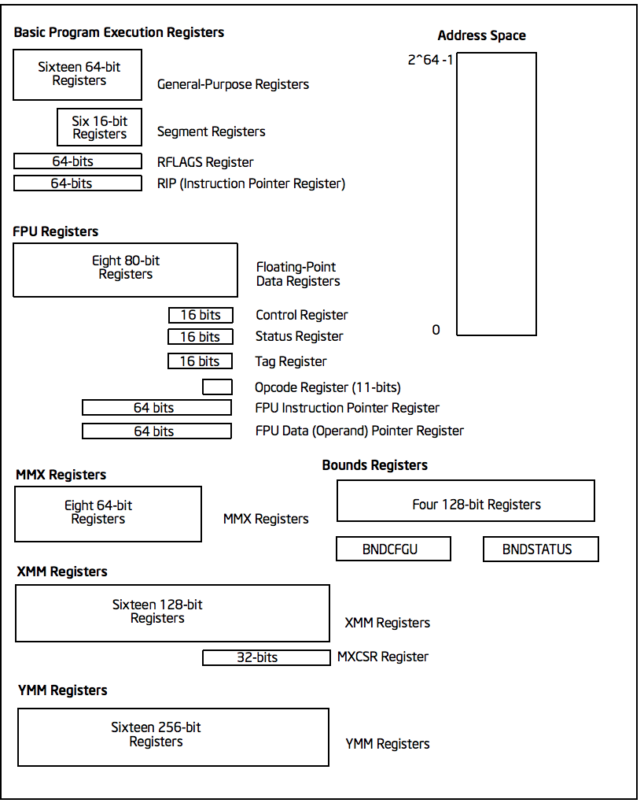

# Nebula

An operating system made for research purposes written in assembly and c.

## Prerequisites

I recommend understanding assembly and c syntax and how a program runs(fetch from memory, decode and execute). It would really help you understand the codebase better. I also recommend reading _Operating Systems 3 Easy Steps by Remzi H.Arpaci-Dusseau and Andrea C.Arpaci-Dusseau_. It's the book I use while making this. 

Also used this website. It was really helpful. https://wiki.osdev.org/
  
Create Makefile: https://wiki.osdev.org/Makefile\_tutorial, then  
run `make`

## To run the OS

### You need the following:

- An emulator for running the OS on your computer(I used VirtualBox)
- An assembler (I used NASM)

## Notes to self(Basic Intro)

An **operating system**is a software controlling the operation of a computer system and its resources. 
A **kernel** manages the resources of the computer system and provides a platform for running applications. 
A **shell** is a special program that allows the user to interact with the operating system.The way it works may vary in different OSes(i.e. File explorer, command line interface, etc.). 

## How a computer starts up

- **_BIOS_** (Basic Input/Output System) is the first software that runs when a computer is turned on. They are copied from the ROM to the RAM. The BIOS then starts executing code such as initializing the hardware and running system checks(i.e. POST - Power-On Self-Test).
- After the BIOS is done executing the code, it checks for a bootable device (i.e. a hard drive, or USB drive) and loads the bootloader from that device into the memory. The **_bootloader_** is simply a device for loading the operating system into the memory.
- The BIOS then loads and starts the operating system. The operating system then takes control of the computer and initializes the rest of the system. The operating system is the main software that runs on the computer and provides the user interface and the ability to run applications.

## How the BIOS finds an OS

### There are 2 methods:

- **_Legacy Booting:_** This is where the BIOS loads the first sector of the bootable device into memory and looks for a specific signature. When this signature is found, it executes the code in that sector. This is the most common method of booting and is supported by all BIOSes. The signature is `0x55AA` and is located at the end of the sector.
- _\*\*EFI:_\*\* The BIOS look into special EFI partitions. The os must also be compiled as an EFI program.

## x86 Registers

 

- Using registers instead of memory is faster.
- Variables built in processors.

### Types

- **General:** The ones that are used most of the time for most ops. "H" and "L" suffixes stand for "high byte" and "low byte".
- **Segment:** Hold the segment of various addresses. Some of them are critical for the good execution of the program. They can only be set by the general registers and special commands.  
- **Program Counter:** This is a special register that keeps track of which memory location the current instruction is being fetched from.
  Not going deep into this.

## Memory Segmentation

We segment memory by using two 16-bit values, which are the segment and the offset. The segment is multiplied by 16 to get the base address, and the offset is added to that to get the final address. This allows us to address 1MB of memory. This is called **real mode**.
$$real\_address = segment * 16 + offset$$
  

### Segment Registers

- DS: Data Segment
- SS: Stack Segment
- CS: Code Segment
- ES, FS, GS: Extra Segment

#### Referencing a memory location

$$segment = [base + index * scale + displacement]$$
 
where(all fields are optional): 
segment = segment register (DS, SS, CS, ES, FS, GS) 
base = base register (BX, BP, SI, DI, SP, BP) 
index = index register (SI, DI, BX, BP) 
scale = scale factor (1, 2, 4, 8) - multiplies the index register by this value before adding it to the base register. 
displacement = a (signed) constant value  

### The Stack

Used in a FIFO manner. Used to save the return address when calling functions. It grows downwards

## Printing to screen

BIOS can be used for basic I/O. So we can call the BIOS to print characters for us. By using **interrupts**. Interrupts are signals that make the processor stop what it is doing to handle that signal.   **Types of interrupts include**:

- Exception e.g. dividing by zero, segmentation fault, etc.
- Hardware e.g. a key being pressed, etc
- Software (through `int`)
   

**Examples of BIOS Interrupts**

- INT 10h: Video
- INT 11h: Equipment Check
- INT 12h: Memory Size
- So on...
